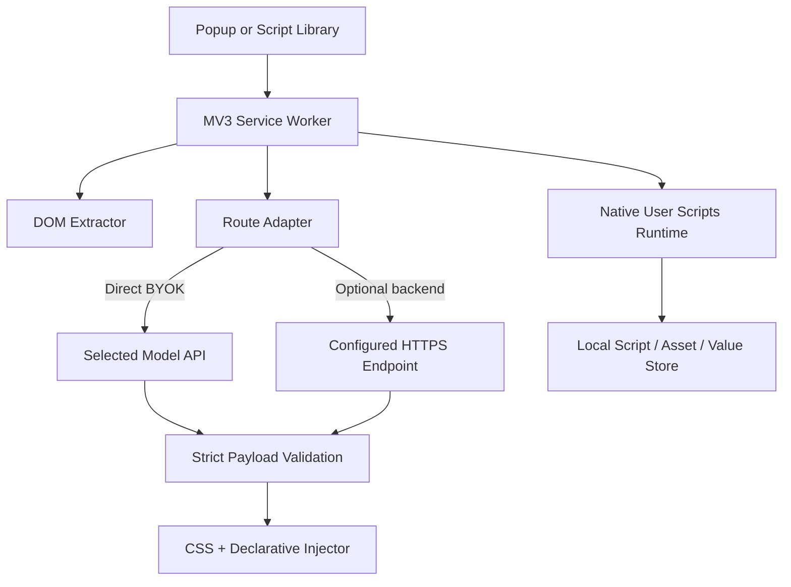

# Frameweave architecture

## Core invariants

1. The open-source base is browser-only. Direct model calls originate in the extension with the user-selected BYOK credential.
2. DOM extraction transmits structure, not content. Text nodes, media payloads, scripts, form values, passwords, and article bodies are excluded.
3. Layout model output has an exact, two-field outer contract: `css` and `javascript`.
4. The layout `javascript` field is declarative data interpreted by packaged code. It is never evaluated as source.
5. User-provided userscripts, fetched `@require` dependencies, and downloaded updates execute only through `chrome.userScripts`.
6. Script state, values, asset cache, and BYOK configuration are local by default.

## Data flow



## AI layout pipeline

`src/background.js` owns the long-lived popup protocol and `routeGeneration()`. The route decision is intentionally isolated:

- `byok` calls `generateLayoutPayload()` with a provider key from `chrome.storage.local`.
- `backend` calls the configured HTTPS endpoint using the same request/response contract.

`src/aiClient.js` validates the exact outer JSON shape before deployment. `src/injector.js` parses the inner `AutomationProgram`, rejects unsupported fields, and passes only data to its static execution function.

The implementation separates preview from commit. Preview records CSS and the validated automation program in `chrome.storage.session`; commit runs automation only after user confirmation.

## Userscript pipeline

1. `src/userscriptMetadata.js` parses and normalizes source headers and editor fields.
2. `src/userscriptStore.js` serializes library mutations so local writes do not race.
3. `src/userscriptAssets.js` fetches and caches `@require` and `@resource` assets without executing them in extension code.
4. `src/userscriptRuntime.js` composes the GM bridge, cached dependencies, resources, and script body into a registration passed to `chrome.userScripts`.
5. `src/userscriptUpdates.js` fetches an update source, compares versions, and proposes or applies a normalized replacement.
6. `src/background.js` schedules daily update checks and re-registers enabled scripts after changes and browser startup.

Chrome can clear dynamic user-script registrations during extension lifecycle events, so startup/install handlers always call `syncUserScripts()`.

## Storage domains

| Domain | Storage | Lifetime |
| --- | --- | --- |
| Settings, BYOK keys, userscripts, values, assets | `chrome.storage.local` | Persistent in this browser profile |
| Picked element, layout preview/deployment, GM tab state | `chrome.storage.session` | Browser session / tab lifecycle |
| Registered scripts, execution worlds | `chrome.userScripts` | Browser-managed; reconciled on startup |

No part of the local core depends on remote authentication, telemetry, or a vendor API other than the provider/backend route explicitly selected by the user.

## Hosted-tier seam

The backend adapter preserves the request contract:

```json
{
  "version": 1,
  "operation": "generate_layout_payload",
  "input": {
    "prompt": "User request",
    "dom": {},
    "responseSchema": {}
  }
}
```

Premium capabilities should add a backend implementation behind this seam. They must not mutate the DOM extractor contract or require the local base to send user page content beyond the explicitly approved request payload.
